<div align="center">
  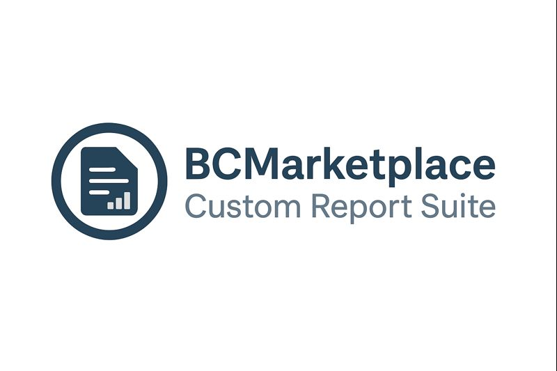
</div>

# BCMarketplace Custom Report Suite

**Version:** 2.2.2  
**Compatibility:** Adobe Commerce 2.4.7-p6+ / Magento 2.4.7-p6+  
**PHP:** 8.2+ / 8.3+  
**Author:** Raphael Baako (rbaako@baakoconsultingllc.com)  
**Company:** Baako Consulting LLC

## Overview

BCMarketplace Custom Report Suite is an enterprise-grade module that enables administrators to create custom SQL-based reports directly from the Adobe Commerce admin panel. This module provides a powerful, flexible reporting solution with advanced features including automated exports, scheduled cron jobs, and comprehensive data visualization.

## Functionality Demonstration

Watch the GIF below to see the module's functionality in action:

<div align="center">
  
</div>

## Features

### Core Functionality
- **Custom SQL Report Builder**: Create reports using custom SQL queries with full admin grid integration
- **Admin Grid Display**: Native Magento admin grid with sorting, filtering, and pagination
- **CSV Export**: Export report data to CSV format
- **Excel XML Export**: Export report data to Excel-compatible XML format
- **Automated Exports**: Schedule automated report exports via cron jobs
- **Dynamic Cron Management**: Automatically create and manage cron jobs for scheduled exports
- **Filename Patterns**: Configurable filename patterns with date/time variables
- **Multi-Report Linking**: Link multiple custom reports to a single automated export

## Installation

### Via Composer (Recommended)

```bash
composer require bcmarketplace/module-custom-report-suite
bin/magento module:enable BCMarketplace_CustomReportSuite
bin/magento setup:upgrade
bin/magento setup:di:compile
bin/magento setup:static-content:deploy -f
bin/magento cache:flush
```

### Manual Installation

1. Copy the module to `app/code/BCMarketplace/CustomReportSuite`
2. Run the following commands:

```bash
bin/magento module:enable BCMarketplace_CustomReportSuite
bin/magento setup:upgrade
bin/magento setup:di:compile
bin/magento setup:static-content:deploy -f
bin/magento cache:flush
```

## Usage

### Creating a Custom Report

1. Navigate to **Reports > Custom Reports > Custom Reports** in the admin panel
2. Click **Add New Report**
3. Enter a **Report Name**
4. Enter your **SQL Query** (see SQL Query Guidelines below)
5. Click **Save**
6. Click **View Report** to see the results

### SQL Query Guidelines

- **SELECT statements only**: Only SELECT queries are supported
- **No DML operations**: INSERT, UPDATE, DELETE are not allowed
- **Column aliases**: Use meaningful column aliases as they become grid column headers
- **Performance**: Optimize queries for large datasets
- **Security**: Always use parameterized queries when possible (future enhancement)

**Example Query:**
```sql
SELECT 
    o.increment_id AS 'Order Number',
    o.created_at AS 'Order Date',
    o.grand_total AS 'Total',
    CONCAT(c.firstname, ' ', c.lastname) AS 'Customer Name'
FROM sales_order o
INNER JOIN sales_order_address c ON o.entity_id = c.parent_id
WHERE o.status = 'complete'
ORDER BY o.created_at DESC
```

### Automated Exports

1. Navigate to **Reports > Custom Reports > Automated Exports**
2. Click **Add New Automated Export**
3. Configure:
   - **Title**: Name for the automated export
   - **Cron Expression**: Schedule (e.g., `0 2 * * *` for daily at 2 AM)
   - **Export Types**: Select export methods
   - **File Types**: Select file formats (CSV, XML)
   - **Filename Pattern**: Use variables like `%Y%`, `%m%`, `%d%`, `%reportname%`
   - **Export Location**: Directory path for exported files
   - **Custom Reports**: Select reports to include
4. Click **Save**

### Filename Pattern Variables

- `%d%` - Day (01-31)
- `%m%` - Month (01-12)
- `%y%` - Year (2 digits)
- `%Y%` - Year (4 digits)
- `%h%` - Hour (00-23)
- `%i%` - Minute (00-59)
- `%s%` - Second (00-59)
- `%W%` - Week number (01-53)
- `%reportname%` - Report name (lowercase, underscores)

**Example Pattern:** `sales_report_%Y%_%m%_%d%` → `sales_report_2024_01_15.csv`

## Configuration

The module can be enabled or disabled from the admin panel:

1. Navigate to **Stores > Configuration > BCMarketplace > Custom Report Suite**
2. Set **Enable Custom Report Suite** to Yes or No
3. When disabled, the menu items will be hidden from the admin navigation


*Screenshot showing the configuration interface where administrators can enable or disable the Custom Report Suite module.*

## Security Considerations

⚠️ **IMPORTANT**: This module executes custom SQL queries. Follow these security best practices:

1. **Access Control**: Only grant access to trusted administrators
2. **SQL Injection**: Always validate and sanitize SQL queries
3. **Read-Only**: The module is designed for SELECT queries only
4. **Audit Logging**: Monitor report creation and execution
5. **Database Permissions**: Use database user with minimal required permissions

### Query Validation and Restrictions

The module includes comprehensive SQL query validation to prevent malicious or dangerous queries. The following operations are automatically blocked:

- **Data Definition Language (DDL)**: ALTER TABLE, CREATE TABLE, DROP TABLE, TRUNCATE, etc.
- **Data Manipulation Language (DML)**: UPDATE, DELETE, INSERT, REPLACE
- **Stored Procedures and Functions**: CREATE/ALTER/DROP FUNCTION, CREATE/ALTER/DROP PROCEDURE
- **Database Operations**: ALTER DATABASE, CREATE DATABASE, DROP DATABASE
- **System Operations**: SET variables, GRANT/REVOKE permissions, FLUSH operations
- **File Operations**: INTO OUTFILE, INTO DUMPFILE, LOAD DATA INFILE
- **Cross-Database Access**: Queries accessing other databases or system tables
- **Multiple Statements**: Queries containing multiple SQL statements separated by semicolons

When a restricted query is attempted, the module displays a clear error message indicating which operation is not allowed. The screenshots below show examples of the security restriction messages that appear when various disallowed query types are attempted:

#### ALTER TABLE Restriction

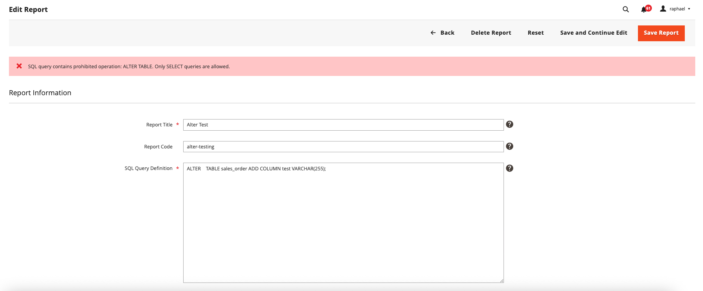

#### DELETE Restriction

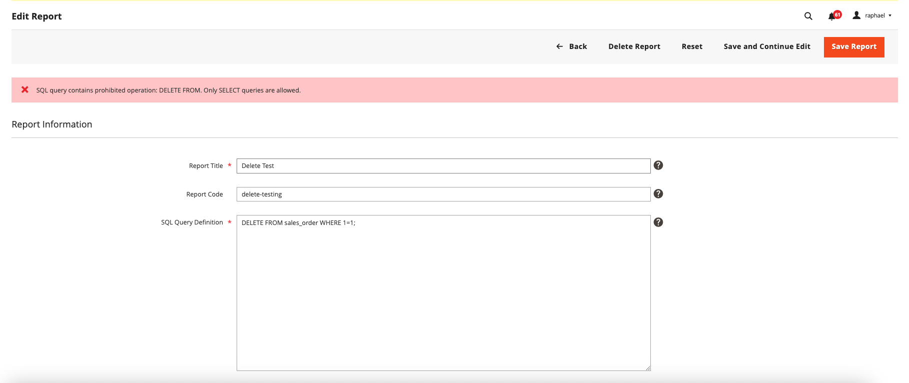

#### UPDATE Restriction

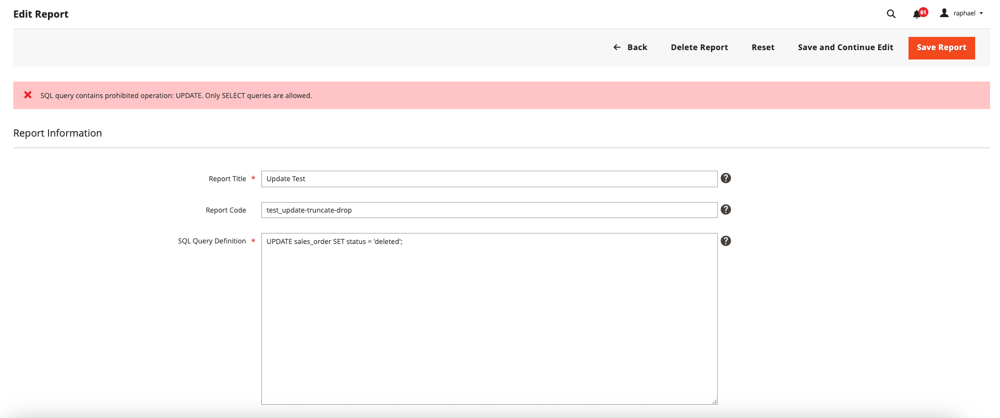

#### INSERT Restriction

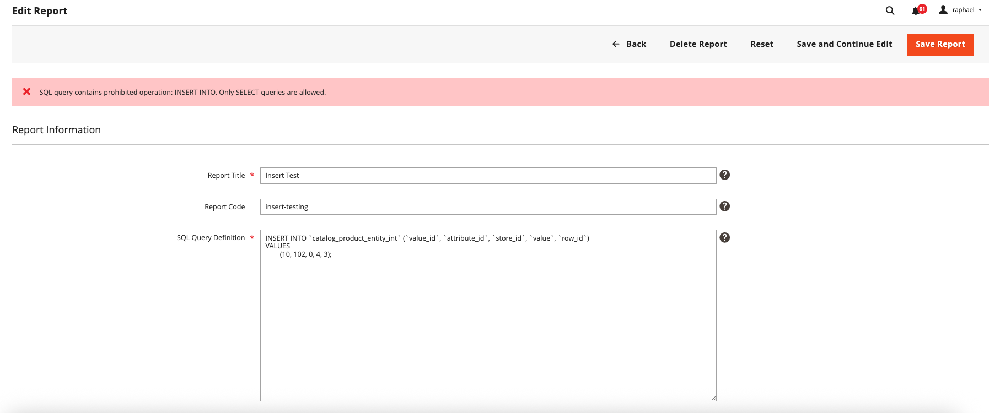

#### DROP TABLE Restriction

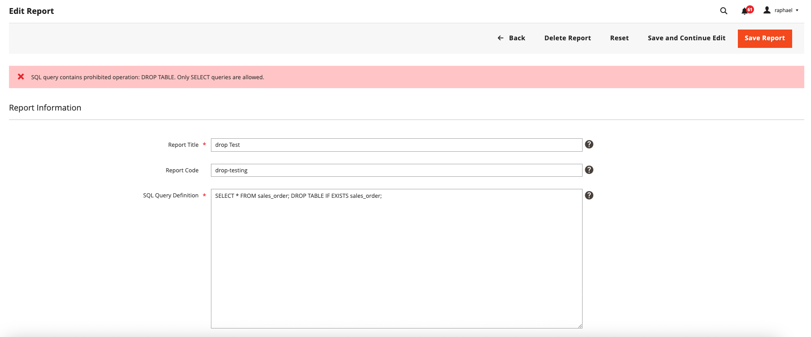

#### CREATE TABLE Restriction

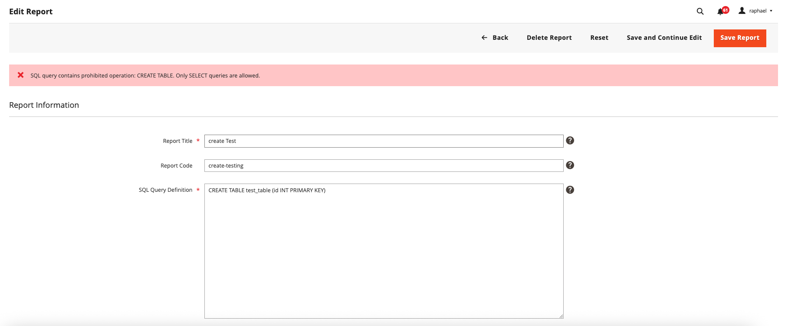

#### Multiple Statements Restriction

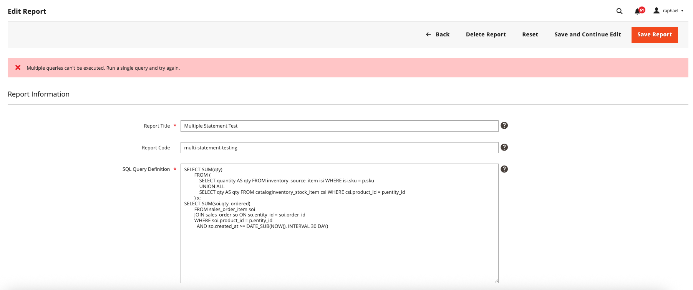

#### INFORMATION_SCHEMA Restriction

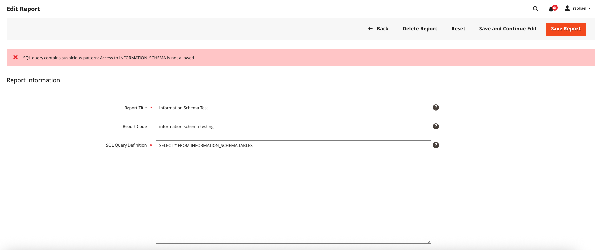

#### Stored Procedure Restriction

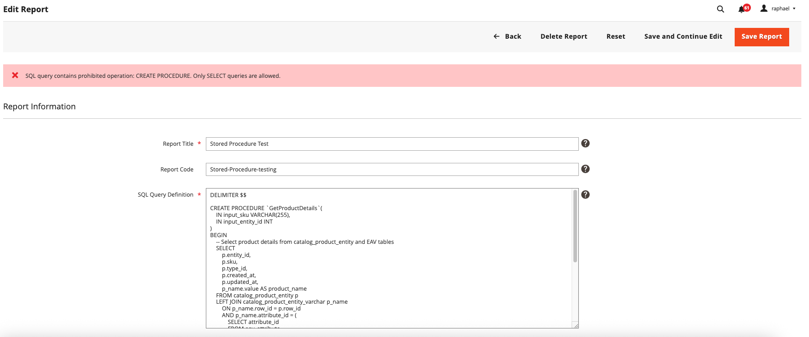

#### File Operations Restriction

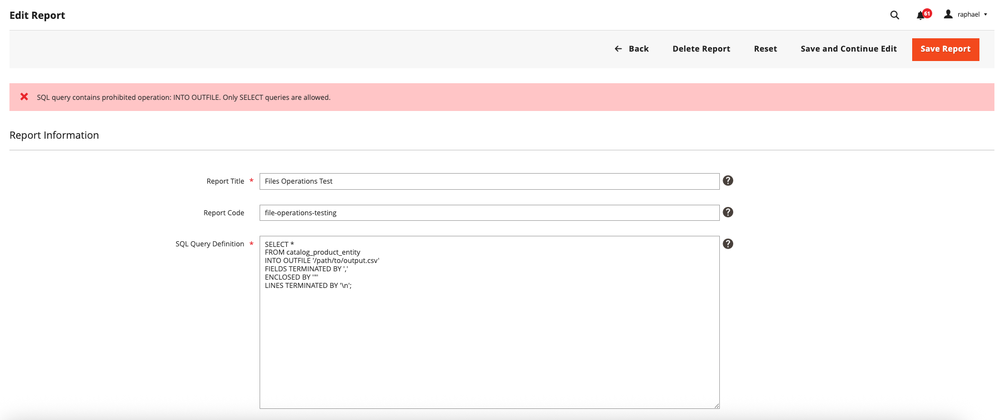

These error messages clearly indicate which operation is not allowed and help prevent accidental or malicious database modifications.

## Changelog

### 2.2.2 (Current)
- Updated documentation with security restriction screenshots
- Enhanced README with comprehensive security examples

### 2.2.0
- Configuration system integrated with BCMarketplace Base module
- Module enable/disable functionality via admin configuration
- Conditional menu visibility based on module configuration

### 2.1.0
- Complete refactoring for Adobe Commerce 2.4.7-p6 compatibility
- Re-namespaced to BCMarketplace\CustomReportSuite
- Removed deprecated code (Zend_Db_Expr, ObjectManager)
- Added strict typing and PHP 8.2+ compatibility
- Performance optimizations
- Enhanced error handling and logging

### 2.0.0
- Initial release

## License

- OSL-3.0
- AFL-3.0

## Support

For issues, questions, or contributions:
- **Email**: rbaako@baakoconsultingllc.com
- **Company**: Baako Consulting LLC

## Acknowledgments

This module was inspired by the Magento 1 Custom Reports extension by Kalen Jordan and contributors. Thank you to the original developers and the Magento community.

---

**Disclaimer**: This module executes custom SQL queries. Use at your own risk and ensure proper security measures are in place. The authors are not responsible for any data loss or security breaches resulting from improper use of this module.
